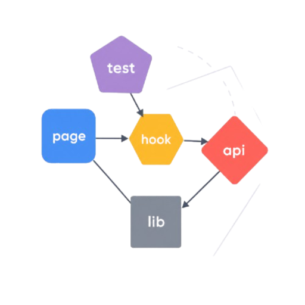

<div align="center">
  

  # depmod

  **See the shape of your codebase.** A terminal-launched, browser-rendered dependency-graph explorer for TypeScript and JavaScript projects.

  [](https://www.npmjs.com/package/depmod-ui)
  [](https://www.npmjs.com/package/depmod-ui)
  [](https://github.com/EduardLupu/depmod/actions/workflows/ci.yml)
  [](LICENSE)
  [](https://nodejs.org)

  <p>
    <a href="#quickstart">Quickstart</a> ·
    <a href="#features">Features</a> ·
    <a href="#commands">CLI</a> ·
    <a href="#development">Develop</a> ·
    <a href="#how-it-works">Architecture</a> ·
    <a href="#contributing">Contribute</a>
  </p>
</div>

---

## What is depmod?

`depmod` is a CLI that statically parses any TypeScript / JavaScript project — Next.js apps, monorepos, libraries, anything `ts-morph` can read — and renders the resulting directed import graph as an interactive dashboard in your browser. Nothing leaves your machine.

It is fast, opinionated, and built to answer the questions that matter when you're trying to understand a codebase you didn't write (or one you wrote two years ago):

- **Which modules are at the center of everything?** (Martin coupling: `Ca`, `Ce`, instability)
- **What would break if I changed this file?** (Blast radius — reverse-BFS over the import graph)
- **What does this page actually pull in?** (Focus mode — `N`-hop neighbourhood, zoom to it)
- **Where are the cycles?** (Iterative Tarjan's SCC; click a cycle to isolate it)
- **What's dead?** (Unreferenced modules, runtime-only-type modules, empty stubs)
- **Which npm packages are declared but never imported?** (Per-workspace static analysis)

## Quickstart

```sh
# Run on the current directory.
npx depmod-ui

# Run on any other project.
npx depmod-ui /path/to/project

# Watch for changes and reload the dashboard as you edit.
npx depmod-ui . --watch
```

The dashboard opens at `http://127.0.0.1:45455` (or the next free port). Multiple projects can be open at the same time — `depmod-ui` scans upward from `45455` automatically.

## Features

| | |
| --- | --- |
| **Two canvases** | 2D Cytoscape (WebGL) for big graphs, 3D three.js force-directed for visual exploration. Toggle with one click. |
| **Classification** | Every module is bucketed (`page` / `api` / `hook` / `component` / `lib` / `test` / `config`). Pills filter, dim, solo, or hide each class. |
| **Path mask** | Comma-separated globs filter the canvas in real time. `**/*.tsx,!**/*.test.*` is one keystroke away. |
| **Inspector** | Selecting a module shows LOC, bytes, `Ca`/`Ce`/instability, exports, dependents, dependencies, transitive bundle estimate, and cycle membership. |
| **Blast radius** | Press `B` on a selected node. The orange overlay shows every module that transitively depends on it, depth-graded. |
| **Focus mode** | Press `F`. The graph hard-isolates the `N`-hop neighbourhood around the selection — across hidden classifications too. |
| **Cycle isolation** | The Cycles list highlights every SCC; click to isolate one and trace the loop. |
| **Dead-code report** | Modules with no incoming edges, no exports, runtime-only-type-imports, or near-empty stubs are surfaced in the Inspector and the directory sidebar. |
| **Unused-deps report** | Cross-references every workspace's `package.json` against actual imports. Honours monorepo `paths` aliases. |
| **Code viewer** | Press `C` (or click "View source") to read the selected file inline in a Monaco editor, with syntax highlighting. |
| **Live reload** | `--watch` re-parses on every save and pushes the new graph over SSE — selection, filters, and view are preserved. |
| **Layout cache** | The first `next build` is the only slow one. After that, layouts are cached per graph version and applied instantly. |

## Commands

| Command | Purpose |
| --- | --- |
| `depmod-ui [path]` | Default — analyse + serve + open browser |
| `depmod-ui serve [path]` | Same as default, made explicit |
| `depmod-ui analyze <path>` | Emit `graph.json` + `metrics.json` to disk (CI/CD) |
| `depmod-ui check <path> --fail-on <rules>` | Exit non-zero when the project breaks an architectural rule |

### Useful flags

```sh
depmod-ui .                        # analyse the current directory
depmod-ui /repo --watch            # re-analyse on every file save
depmod-ui /repo --port 51000       # pin a specific port
depmod-ui /repo --no-open          # don't auto-open the browser
depmod-ui /repo --include "src/**" # restrict the parsed set
depmod-ui /repo --exclude "**/*.test.*"
depmod-ui /repo --no-gitignore     # ignore .gitignore (parse everything)
depmod-ui /repo --exclude-tests    # omit .test.ts / .spec.ts from the graph
depmod-ui /repo --no-cache         # bypass the incremental .depmod-cache

depmod-ui check .                  # CI gate: cycles, dead-code, unused deps, instability
depmod-ui check . --fail-on cycles,unused-deps
depmod-ui check . --fail-on instability:>0.7
```

## Development

### Requirements

- Node ≥ 20.18 (`.nvmrc` pins 24.14)
- [pnpm](https://pnpm.io) ≥ 10 (`corepack enable` is enough)

### Setup

```sh
nvm use            # pins the right Node
corepack enable    # turns on the bundled pnpm
pnpm install
pnpm build         # types → parser → web (Next build) → CLI
pnpm depmod-ui .   # smoke-run against the monorepo itself
```

### Daily loop

```sh
pnpm -r test                     # all packages, all tests
pnpm typecheck                   # tsc --noEmit across every workspace
pnpm lint                        # biome
pnpm format                      # biome --write
pnpm --filter web dev            # iterate on the dashboard with HMR
```

### Workspace layout

| Path | Role | Published? |
| --- | --- | --- |
| [`packages/types`](packages/types) | Zod-validated `Graph` schema. Single source of truth shared across CLI + web. | private (workspace) |
| [`packages/parser`](packages/parser) | `ts-morph` static analyser, metrics, cycles, dead-code, unused-deps. | private (workspace) |
| [`packages/cli`](packages/cli) | The `depmod-ui` command. Spawns the bundled Next.js server, pipes the graph in via a session file. | **public** (`depmod-ui` on npm) |
| [`apps/web`](apps/web) | Next.js 15 App Router dashboard. Cytoscape canvas, three.js canvas, inspector, status bar, settings. | bundled inside the CLI tarball |
| [`bench`](bench) | Benchmark harness over OSS targets (`vercel-commerce`, `shadcn-taxonomy`, `documenso`, `cal.com`). | private (workspace) |

## How it works

```
┌────────────────────────┐     ┌─────────────────────────┐     ┌─────────────────────┐
│      depmod-ui         │     │   Next.js server        │     │       browser       │
│  (this CLI process)    │     │   (spawned by the CLI)  │     │                     │
│                        │     │                         │     │                     │
│  1. ts-morph parse  ───┼──▶  │   /api/graph reads      │  ──▶│  Cytoscape / three  │
│  2. write session.json │     │   the session file ───▶ │     │  Inspector / etc.   │
│  3. spawn next start   │     │                         │     │                     │
│  4. (--watch) chokidar │     │   /api/events streams   │  ──▶│  Live reload on SSE │
│     re-parse on save   │     │   reanalyzed events     │     │                     │
└────────────────────────┘     └─────────────────────────┘     └─────────────────────┘
```

The parser is pure (`(rootDir) → Graph`). The web app never re-parses; it only consumes the JSON the CLI publishes. Same input → same byte-identical graph in the CLI summary and the dashboard.

Implementation notes worth knowing:

- **Path aliases**: in monorepos, each workspace's `tsconfig.json` `paths` aliases are read independently and used as a fallback resolver. ts-morph alone would only honour the root tsconfig — depmod's [`workspace-aliases.ts`](packages/parser/src/workspace-aliases.ts) closes the gap.
- **External capture**: when ts-morph resolves `react` to its `.d.ts` in `node_modules`, that's not an internal edge. depmod records it as an external import for the unused-deps report instead of silently dropping it.
- **Hard isolation**: focus and blast modes use `display: none` on out-of-scope nodes (not opacity dimming), so the canvas reflects exactly what the user asked for. In-scope hidden-class nodes still appear — the network is the answer.
- **Incremental cache**: per-file slices keyed by content hash + parser version + tsconfig hash + file-set hash live in `.depmod-cache`. Unchanged files are reused; a `PARSER_VERSION` bump invalidates everything.

For the long-form design rationale, see [`docs/specs/`](docs/specs).

## Benchmark snapshot

| Target | Tier | Files | Edges | Cycles | LOC | Parse |
| --- | --- | ---: | ---: | ---: | ---: | ---: |
| `vercel-commerce` | primary | 65 | 120 | 1 | 3,896 | 403 ms |
| `shadcn-taxonomy` | medium | 127 | 247 | 0 | 7,730 | 344 ms |
| `documenso` | stress | 1,845 | 2,834 | 23 | 232,396 | 3,584 ms |

Full results live in [`bench/results/`](bench/results/). Re-run locally with `pnpm bench`.

## Contributing

PRs welcome — see [CONTRIBUTING.md](CONTRIBUTING.md) for setup, daily commands, branching, changesets, and the release flow. Before opening a PR:

1. Run `pnpm typecheck`, `pnpm -r test`, and `pnpm lint`. All three must pass.
2. Add tests next to whatever you changed. The parser, CLI, and web layers all have vitest suites in `test/` or `*.test.ts` siblings.
3. Keep the diff focused. User-visible CLI changes need a `.changeset/` file (`pnpm changeset`).

If you want to suggest a direction, open an issue first — happy to talk shape before code.

## License

MIT © [Eduard Lupu](https://github.com/eduardlupu)
